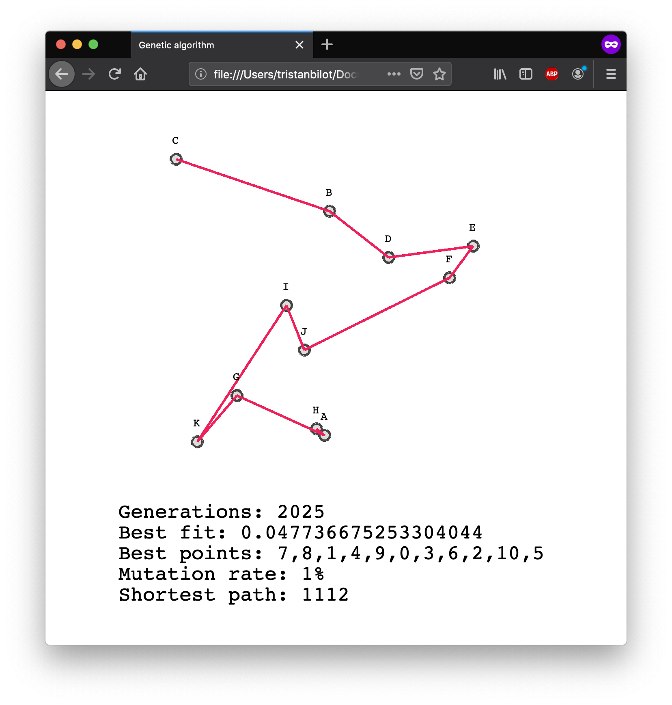
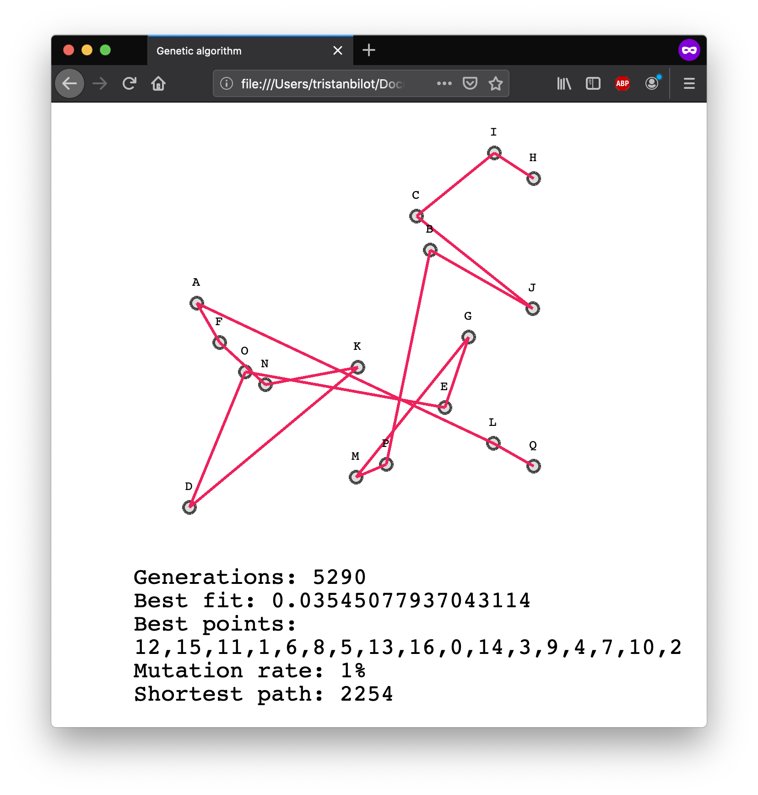

# genetic-travelling-salesman

An heuristic & genetic algorithm to approach the TSA problem with a nice result in a convenient time.<br>
Basically, one gene is at the beginning a random set of (x,y) points peeked from the initial city points. 
Each generation is thus a number of genes which will learn by themselves to fit the lowest total length condition.<br><br>
The crossover step consists in choosing the best genes of the precedent generation and to cross them to get a new gene with 
similar aspects, and so on. The mutation rate allows the algorithm to avoid the stagnation on a bad solution by adding random modifications on each gene.

<p align="center">
  
  
</p>

## Usage
The four main methods of the algorithms are:

```Javascript
population.naturalSelection();
population.newGeneration();
population.fitness();
population.evaluate();
```
* the natural selection part is where the algorithm selects the genes with the best results considering the last generation.
* then, a new generation is built from these champion genes.
* fitness is just here to normalize the results the gene values.
$ the evaluation method checks wether the final score is enough good to stop the algorithm. Otherwise, it selects the best genes for the next generation.
